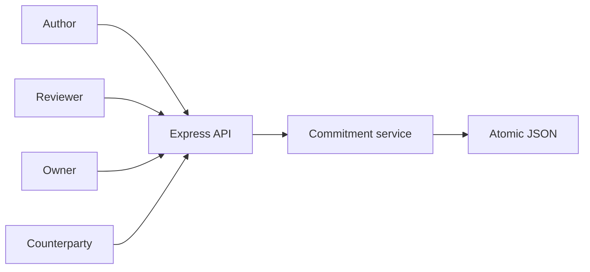
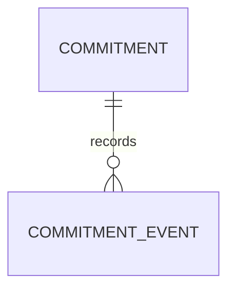
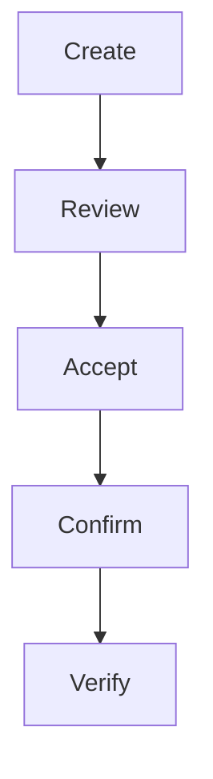
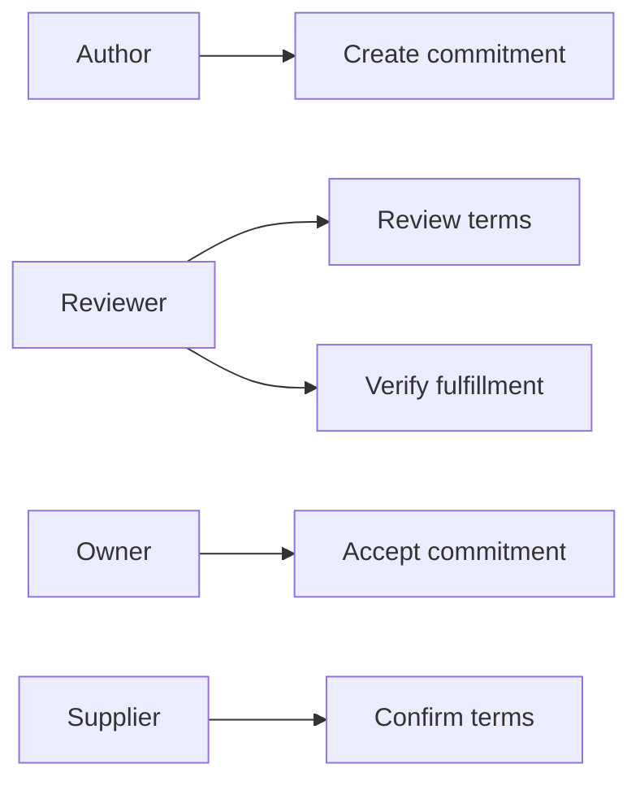
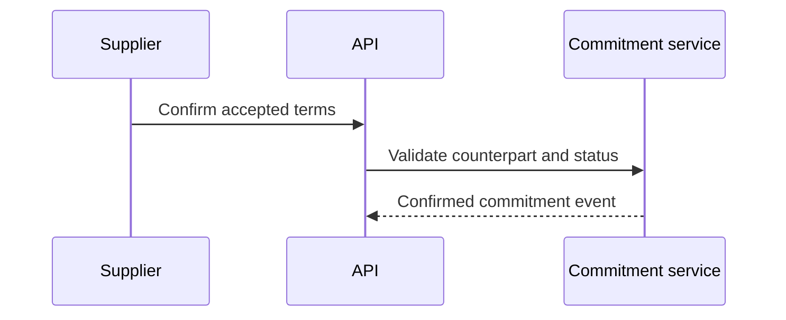

# Supplier Evidence Access Commitment Control Platform
## The Problem
Evidence sharing often carries explicit commitments about use, handling, confidentiality, and downstream retention. When commitments are managed informally, teams cannot prove who accepted the terms or whether fulfillment was independently verified.
## The Solution
This service captures an evidence commitment, routes it to an assigned reviewer, requires owner acceptance, captures counterparty confirmation, and allows the reviewer to verify fulfillment against documented evidence. Every transition is authority-bound and audit logged.
## Live Demo and Tech Stack
Run `http://localhost:58400/health`. The stack uses Node.js 22, Express 5, atomic JSON persistence, Vitest, and GitHub Actions. The service binds to `0.0.0.0` for LAN operation.
## Local Setup and Run Instructions
```bash
npm install
npm test
env -u PORT node server.mjs
```
## System Documentation
### System Architecture Diagram

### Entity Relationship Diagram

### Data Flow Diagram

### Use Case Diagram

### Sequence Diagram

## Owner

Created and maintained by Kholipha Ahmmad Al-Amin.

Software Engineer and AI Specialist

Founder and CEO of EquiSaaS BD

Principal Consultant at AR IT Consultancy

Full Stack Developer and SaaS Product Builder

### Official links

Portfolio: https://kholipha-ahmmad-al-amin.equisaas-bd.com/

GitHub: https://github.com/kholipha-ahmmad-al-amin

LinkedIn: https://www.linkedin.com/in/kholipha-ahmmad-al-amin

X: https://x.com/al_amin5519

Facebook: https://www.facebook.com/kholipha.ahmmad.al.amin

Instagram: https://www.instagram.com/kholipha.ahmmad.al.amin

## Ownership

This project was created and is maintained by Kholipha Ahmmad Al-Amin.

